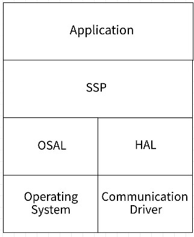
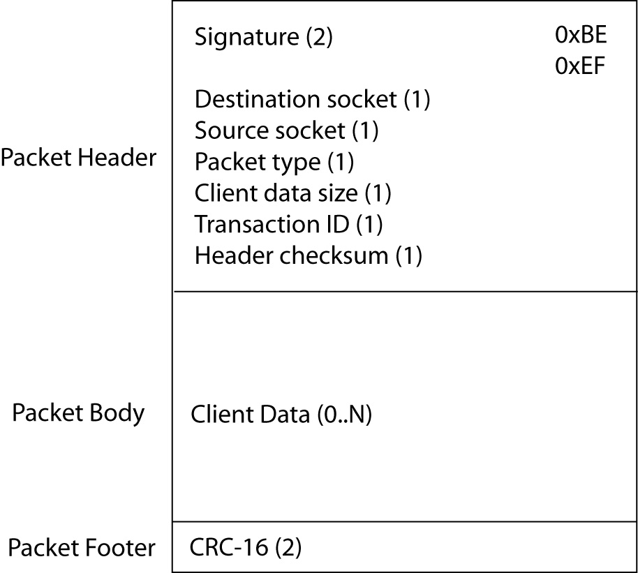
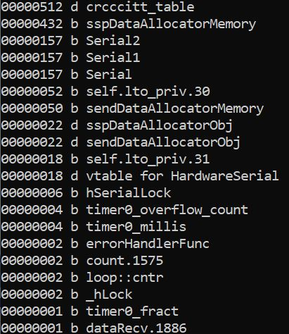

# Simple Socket Protocol for Embedded Systems

Originally published on CodeProject at: <a href="https://www.codeproject.com/Articles/5321271/Simple-Socket-Protocol-for-Embedded-Systems"><strong>Simple Socket Protocol for Embedded Systems</strong></a>

David Lafreniere, Jan 2022.

<h2>Introduction</h2>

Software transport communication protocols are difficult to implement. Embedded systems use a variety of hardware communication interfaces: UART, CAN bus, SPI, Bluetooth LE, etc&hellip; In my experience, a custom-designed software transport protocol is usually implemented between the hardware driver and the application code. These one-off protocols are sometimes fragile, difficult to use, with minimal features. Maybe error checking is implemented, or retries, or acknowledgements, or thread-safety; or not.&nbsp;

Creating a portable library capable of supporting the smallest embedded systems, with or without an operating system, is challenging. The Simple Socket Protocol (SSP) implementation presented here is a platform agnostic transport protocol supporting a socket-like interface. The goal is a reusable library for embedded systems to communicate over disparate (non-Ethernet) hardware interfaces while abstracting the operating system and hardware platform specifics.

SSP supports the following features:

<ul>
	<li>Implemented in C</li>
	<li>Supports&nbsp;C or C++ application code</li>
	<li>Arduino, Eclipse and Visual Studio project included</li>
	<li>Socket-based communication</li>
	<li>Customizable operating system and hardware abstraction layer interfaces</li>
	<li>Thread-safe library</li>
	<li>Supports any physical hardware transport (UART, SPI, CAN, BLE, ...)</li>
	<li>Fixed block allocator or global heap for dynamic storage</li>
	<li>Duplicate message prevention</li>
	<li>Guaranteed send message order preserved</li>
	<li>Automatic retries</li>
	<li>Message timeouts</li>
	<li>Message acknowledgements</li>
	<li>Message corruption detection</li>
	<li>Asynchronous send and receive</li>
	<li>Sender callback on send success or failure</li>
	<li>Receiver callback on data received</li>
	<li>Connectionless data send (i.e. not connection-oriented)</li>
	<li>Power savings hooks</li>
	<li>Error callbacks and get last error</li>
	<li>Automatic endianness handling (protocol, not application payload)</li>
	<li>Compact code and memory footprint</li>
	<li>Easy compile-time configuration using a single header file</li>
</ul>

SSP does not support the following:

<ul>
	<li>Message fragmentation</li>
	<li>Blocking (synchronous) send or receive</li>
	<li>Dynamic negotiation of communication operational parameters</li>
</ul>

The source code should build and execute on any C or C++ system. SSP is implemented in C to offer support for most systems. To make evaluation easier, there is a memory buffer build option that allows testing the library without communication hardware.

I&rsquo;ve used variations of this code on many different projects over 20-years or so, mainly small embedded devices communicating with one another over UART/CAN/SPI, or to a host device over BLE/Serial. If your embedded device is equipped with UART, or other non-Ethernet communication interface, and a simple software transport protocol is required then read on!

<h3>What is SSP?</h3>

Let me further clarify what SSP is and is not.

A transport layer protocol moves data between two endpoints. TCP/IP is a transport layer protocol, for instance. An application layer protocol makes use of the transport to send application specific data. HTTP is an application layer protocol.

SSP is a transport layer protocol that moves data between two devices over any hardware communication interface. Two embedded CPU&rsquo;s, an embedded CPU and a PC, or whatever.

SSP is a point-to-point communication protocol; not a one-to-many publish/subscribe protocol.

SSP is a peer-to-peer protocol; not a master-slave.

SSP is used to send binary data, XML, JSON, or whatever the application requires.

SSP is not intended to implement the Berkeley sockets API. It is not a TCP/IP stack.

SSP is lightweight at about 2.5k of code ROM and a few hundred bytes of RAM at minimum. The RAM varies depending on the message size and maximum buffers configured.

SSP was designed to work over UART, CAN, BLE, or any other hardware communication interface. If a CPU supports Ethernet, then of course use a TCP/IP stack on that interface.

SSP supports a maximum 256-byte packet size. 10-byte header, 244-byte maximum payload, and 2-byte CRC.

SSP was not designed by committee and does not conform to any standard.

<h2>Overview</h2>

I&rsquo;ll first present the API, simple SSP usage examples, and then dive into the technical details.

The SSP API within <strong>ssp.h</strong> is shown below:

<pre>
// Called once per port to initialize
SspErr SSP_Init(SspPortId portId);

// Called once when application terminates
void SSP_Term(void);

// Open a socket on a specified port
SspErr SSP_OpenSocket(SspPortId port, UINT8 socketId);

// Close a socket
SspErr SSP_CloseSocket(UINT8 socketId);

// Send data over a socket
SspErr SSP_Send(UINT8 srcSocketId, UINT8 destSocketId, const void* data, UINT16 dataSize);

// Send multiple data arrays over a socket
SspErr SSP_SendMultiple(UINT8 srcSocketId, UINT8 destSocketId, INT16 numData,
    void const** dataArray, UINT16* dataSizeArray);

// Listen for incoming data on a socket using a callback function
SspErr SSP_Listen(UINT8 socketId, SspDataCallback callback, void* userData);

// Get number of pending messages in outgoing queue
UINT16 SSP_GetSendQueueSize(SspPortId portId);

// Determine if the incoming queue has data or not
BOOL SSP_IsRecvQueueEmpty(SspPortId portId);

// Process outgoing and incoming socket messages
void SSP_Process(void);

// Register for callbacks when SSP error occurs
void SSP_SetErrorHandler(ErrorHandler handler);

// Get the last SSP error
SspErr SSP_GetLastErr(void);</pre>

Send status and receive data is notified by registering a callback function conforming to the <code>SspDataCallback </code>function signature.

<pre>
/// SSP callback function signature for receiving socket data asynchronously.
/// Called upon transmission success or failure. 
/// @param[in] socketId The socket identifier.
/// @param[in] data The incoming data if type is SSP_RECEIVE. The outgoing data
///     if type is SSP_SEND.
/// @param[in] dataSize The number of bytes pointed to by data.
/// @param[in] type The type of callback: SSP_RECEIVE or SSP_SEND.
/// @param[in] status The status of the send/receive.
/// @param[in] userData Optional user data pointer that was provided in 
///     SSP_Listen() callback registration. 
typedef void(*SspDataCallback)(UINT8 socketId, const void* data, UINT16 dataSize,
    SspDataType type, SspErr status, void* userData);
</pre>

<h2>Using the Code</h2>

Initialize one or more communication ports.

<pre>
    // Initialize the ports
    SSP_Init(SSP_PORT1);
</pre>

Open a socket on a specified port.

<pre>
    // Open socket 0
    SspErr err = SSP_OpenSocket(SSP_PORT1, 0);
</pre>

Register for callbacks on function <code>SspCallbackSocket0()</code>. The third argument is optional user data will be passed back during the callback, or <code>NULL</code>.

<pre>
    // Listen on socket 0
    err = SSP_Listen(0, &amp;SspCallbackSocket0, NULL);
</pre>

Send data over a socket. In this example, the source socket is 0 and destination socket is 1.

<pre>
    char sendData[32];
    snprintf(sendData, 32, &quot;Hello World!&quot;);

    // Send data
    err = SSP_Send(0, 1, sendData, UINT16(strlen(sendData))+1);
</pre>

Handle callbacks from the SSP library. Use the callback argument to determine if the callback is a send or receive notification, and the error status.

<pre>
static void SspCallbackSocket0(UINT8 socketId, const void* data, UINT16 dataSize,
    SspDataType type, SspErr status, void* userData)
{
    // Received data callback?
    if (type == SSP_RECEIVE)
    {
        // Received successfully?
        if (status == SSP_SUCCESS)
        {
            // Do something with incoming data
            SSP_TRACE_FORMAT(&quot;SSP_RECEIVE PORT1: %s&quot;, (char*)data);
        }
    }
    // Send data callback?
    else if (type == SSP_SEND)
    {
        if (status == SSP_SUCCESS)
            SSP_TRACE(&quot;SSP_SEND PORT1 SUCCESS&quot;);
        else
            SSP_TRACE(&quot;SSP_SEND PORT1 FAIL&quot;);
    }
}
</pre>

<code>SSP_Process()</code> must be called periodically to send/receive messages.

<pre>
        do
        {
            // Call while there is send or receive data to process
            SSP_Process();
        } while (!SSP_IsRecvQueueEmpty(SSP_PORT1) ||
                 SSP_GetSendQueueSize(SSP_PORT1) != 0);
</pre>

When to call <code>SSP_Process()</code> is application defined. In this example, <code>SSP_Process()</code> is called repeatedly until all send or receive data is processed. <code>SSP_Process()</code> handles all sending, receiving and timeouts. If multithreaded, call from a single thread of control. <code>SSP_Listen()</code> registered callbacks are invoked during <code>SSP_Process()</code>. Ideas of when to call <code>SSP_Process()</code>.

<ul>
	<li>Periodically call from the main loop.</li>
	<li>Periodically call from a task loop.</li>
	<li>Periodically call using a timer.</li>
	<li>Initiate calling when the hardware driver receives data.</li>
	<li>Initiate calling when the application sends a message.</li>
</ul>

At application exit call the terminate function and close sockets.

<pre>
    err = SSP_CloseSocket(0);
    SSP_Term(); 
</pre>

<h3>Usage Notes</h3>

SSP socket communication over an embedded hardware communication port&nbsp;offers convenient design paradigms. Ideas on SSP usage follows.

<h4>Socket Types</h4>

Sockets allow categorizing communications between two devices. Here are some ideas of different socket types.

<ul>
	<li>Sensor socket &ndash; send periodic sensor data</li>
	<li>Alarm socket &ndash; send alarm notifications</li>
	<li>Log socket &ndash; send log data</li>
	<li>Command socket &ndash; send device commands</li>
	<li>Configuration socket &ndash; send configuration data</li>
</ul>

<h4>Streaming</h4>

Maybe an embedded device locally accumulates log data and the logs need to be transferred to another device for permanent storage or post-processing. Streaming the data over a log socket is easy. To start the transfer, send the first log message using <code>SSP_Send()</code>. During the sender socket callback notification, if <code>SSP_SEND </code>is <code>SSP_SUCCESS</code> then send the next log message. Keep sending a new log messages on each <code>SSP_SEND</code>/<code>SSP_SUCCESS</code>&nbsp;callback until all logs are transferred. SSP allows calling <code>SSP_Send()</code> during a notification callback. This is an easy way to stream data without overwhelming the available buffers since only one send queue entry is used at a time.

<h4>Message Throttling</h4>

A low priority socket can suspend/slow data transfer if SSP is busy by using <code>SSP_GetSendQueueSize()</code>. Let&rsquo;s say we are sending log data using the streaming method above and 10 total send queue buffers exist. Before sending a log message the queue size is checked. If 5 or more pending queue messages, the log data is not sent thus preserving the send queue for more critical messages. A timer periodically checks if the queue usage drops below 5 and calls <code>SSP_Send()</code> to continue log streaming. Using the available send queue entries the application best decides how to prioritize message sending.

<h4>Communication Down</h4>

SSP is connectionless, meaning SSP does not negotiate a connection between two devices. The sender opens a port and sends data. If a listener does not respond, a <code>SSP_SEND_RETRIES_FAILED</code> error occurs.

Loss of communication is detected in the <code>SSP_Listen()</code> callback if <code>SSP_SEND </code>and not <code>SSP_SUCCESS </code>is detected. Maybe an existing socket is used for communication loss detected. Or perhaps a heartbeat socket is dedicated to periodically ping the remote to detected communication loss. These details are left to the application.

<h3>Configuration</h3>

All SSP options are defined within <strong>ssp_opt.h</strong>. Some options are shown below:

<pre>
// How long to wait for remote CPU to provide and ACK or NAK
#define SSP_ACK_TIMEOUT     300    // in mS

// How many times to retry a failed message
#define SSP_MAX_RETRIES     4

// How long to wait for a incoming character polling com port
#define SSP_RECV_TIMEOUT    10  // in mS

// Maximum number of outgoing messages per port that can be queued
#define SSP_MAX_MESSAGES    5

// Maximum packet size including header, body and CRC
#define SSP_MAX_PACKET_SIZE 64

// Define to output log messages
#define USE_SSP_TRACE

// Define uses fixed block allocator. Undefine uses malloc/free. 
#define USE_FB_ALLOCATOR
</pre>

Search <code>TODO </code>within the source code to find other application specific code locations.

The CRC table or loop based implementation is defined within <strong>ssp_crc.c</strong>. The table-based version is faster, but the loop version consumes less storage.

<h3>Porting</h3>

The OS abstraction interface (OSAL) is in <strong>ssp_osal.h</strong>. The OSAL provides a critical section, software locks and ticks for timing. For systems without an operating system, lock-related functions below will do nothing.

<pre>
void SSPOSAL_Init(void);
void SSPOSAL_Term(void);

void SSPOSAL_EnterCritical(void);
void SSPOSAL_ExitCritical(void);

SSP_OSAL_HANDLE SSPOSAL_LockCreate(void);
void SSPOSAL_LockDestroy(SSP_OSAL_HANDLE handle);
BOOL SSPOSAL_LockGet(SSP_OSAL_HANDLE handle, UINT32 timeout);
BOOL SSPOSAL_LockPut(SSP_OSAL_HANDLE handle);

UINT32 SSPOSAL_GetTickCount(void);
</pre>

The hardware abstraction interface (HAL) is in <strong>ssp_hal.h</strong>. HAL is the physical layer. The HAL isolates the SSP library from the details for sending/receiving data over a hardware interface. The HAL may support multiple interface types. For instance, port 1 is a UART and port 2 is SPI.

<pre>
void SSPHAL_Init(SspPortId portId);
void SSPHAL_Term(void);

BOOL SSPHAL_PortOpen(SspPortId portId);
void SSPHAL_PortClose(SspPortId portId);
BOOL SSPHAL_PortIsOpen(SspPortId portId);

BOOL SSPHAL_PortSend(SspPortId portId, const char* buf, UINT16 bytesToSend);
BOOL SSPHAL_PortRecv(SspPortId portId, char* buf, UINT16* bytesRead, UINT16 maxLen, UINT16 timeout);

void SSPHAL_PortFlush(SspPortId portId);
BOOL SSPHAL_IsRecvQueueEmpty(SspPortId portId);

void SSPHAL_PowerSave(BOOL enable);
BOOL SSPHAL_IsPowerSave(void);
</pre>

Each abstraction interface must be implemented for a specific target. Example implementations for Windows, Arduino, and C++ standard library are located within the <strong>port </strong>directory.

The HAL interfaces to the communication driver. <code>SSPHAL_PortSend()</code> sends data and <code>SSPHAL_PortRecv()</code> reads data. Typically the driver uses internal send/receive buffers to facilitate data communication. The driver details are application specific. Maybe the driver is interrupt driven sending/receiving one or more bytes per interrupt. Or perhaps DMA transfer is utilized. Regardless, the HAL abstracts those details from the SSP library.

<h2>Layers</h2>

The layer diagram below shows the major components.

<ul>
	<li>Application &ndash; the application code.</li>
	<li>SSL &ndash; the Simple Socket Protocol library.</li>
	<li>OSAL &ndash; the operating system abstraction layer.</li>
	<li>HAL &ndash; the hardware abstraction layer.</li>
	<li>Operating System &ndash; the operating system, if any.</li>
	<li>Communication Driver &ndash; the software driver for the hardware interface.</li>
</ul>

<h3>SSP Layers</h3>

SSP consists of two layers: SSPCOM (<strong>ssp_com.c</strong>) and SSP (<strong>ssp.c</strong>).

<h4>SSPCOM</h4>

The SSPCOM module sends/receives a single SSP packet. SSPCOM responsibilities include:

<ul>
	<li>Send and receive SSP packets</li>
	<li>Assemble SSP packets</li>
	<li>Parse incoming data</li>
	<li>Error detection</li>
	<li>Open and close sockets</li>
	<li>Socket to port mapping</li>
</ul>

An SSP packet is comprised of a packet header, client data, and footer. The header specifies source/destination sockets, message type, transaction ID and the body length among other things. The client data is the application defined payload sent to the remote CPU. The packet footer is a 16-bit CRC used for error detection.

<h4>SSP</h4>

SSP is the client application interface. SSP utilizes SSPCOM services and provides a protocol layer that guarantees packet delivery through message acknowledgement, message retries and timeouts. SSP responsibilities include:

<ul>
	<li>Send and receive client data</li>
	<li>Send queue</li>
	<li>Timeouts</li>
	<li>Retries</li>
	<li>Thread-safety</li>
	<li>Client callback notification</li>
	<li>Error callback notification</li>
</ul>

SSP clients send data to/from a remote system using a socket ID. SSP automatically retries failed transmissions and notifies if the packet ultimately cannot be delivered.

<h2>Simple Socket Protocol (SSP)</h2>

Simple Socket Protocol (SSP) is a software-based, binary transport protocol transmitted over any hardware communication interface. SSP manages multiple hardware ports, sockets, packets, error detection, timeouts and retries.

SSP provides a common API for software communications. The SSP library is implemented in C. The library is thread-safe.

<h3>Sockets</h3>

All SSP packets are sent and received through sockets. A SSP socket is an endpoint of a bidirectional inter-process communication over a communication interface. A socket paradigm multiplexes a single hardware interface to facilitate private communication between different subsystems endpoints residing on separate processors. A socket provides the appearance of multiple independent communication channels.

The SSP library simultaneously supports multiple hardware communications ports. On a single CPU, sharing sockets across ports is not supported. A socket ID must be unique across all ports, meaning socket ID 1 on two ports is not allowed.

<h3>Packets</h3>

Messages are sent using packets. A packet contains a 10-byte header, the packet body with a variable length, and 2-byte footer.

The SSP packet is structured as shown below:

Use <code>SSP_Send()</code> or <code>SSP_SendMultiple()</code> to send data. All sending is asynchronous. Data is queued to be sent during <code>SSP_Process()</code>. A transmission failure is reported asynchronously to the client on the <code>SSP_Listen()</code> registered callback function.

<h3>Packet Types</h3>

SSP provides one 8-bit location for packet type.

<ol>
	<li>Data Packet</li>
	<li>ACK Packet</li>
	<li>NAK Packet</li>
</ol>

<h4>Data Packet</h4>

Data packets transport data to a destination socket. The client data portion contains any data whatsoever; there is no structure to the data other than what the two communication parities agree upon. The sender&rsquo;s data packet is routed to the destination socket. The receiver processes the incoming data on the <strong>SSP_Listen()</strong> registered callback.

<h4>ACK Packet</h4>

An ACK (acknowledge) packet is sent in response to a data packet.&nbsp;ACK indicates successful reception of the data packet. The SSP layer does not route ACK packets to the client.

The ACK packet acknowledges a single data packet. The data packet to be acknowledged is identified using the transaction ID. Once the receiver SSP acknowledges the data packet, the sender SSP removes the outgoing message from the send queue.

<h4>NAK Packet</h4>

A NAK (negative-acknowledge) packet is sent in response to a data packet. NAK indicates unsuccessful reception of the data packet. NAK responses will trigger a retry of the message indicated by the transaction ID. After a certain number of retries, the failure will be returned to the caller.

A NAK packet is sent upon reception of a message if one of the following is true:

<ul>
	<li>The header checksum is valid but the packet footer CRC is not valid. This means the header is intact enough to NAK, but the client data and/or footer is corrupted or not fully received within <code>SSP_RECV_TIMEOUT</code>.</li>
	<li>A listener callback is not registered on the destination socket. This means the message was received correctly, but the application isn&rsquo;t listening to the socket.</li>
</ul>

<h3>Parsing</h3>

Each packet contains two synchronization bytes: 0xBE and 0xEF. The parser uses these bytes to determine when the packet header starts. The header has an 8-bit checksum used by the parser to determine if the remaining packet should be parsed or not. The client data size is used to parse the packet data and footer. The 16-bit CRC packet footer allows error checking the entire packet before forwarding to the registered client.

<h3>Queuing</h3>

SSP stores each data packet in a queue for asynchronous transmission. The data packet is removed from the send queue if the receiver ACK&rsquo;s the packet or all timeout retries have been exhausted.

SSP uses either a fixed block allocator or the global heap to manage buffers. Define <code>USE_FB_ALLOCATOR </code>in <strong>ssp_opt.h</strong> to enable the fixed block allocator.

The fixed block allocator is documented in the article:

<a href="https://www.codeproject.com/Articles/1272619/A-Fixed-Block-Memory-Allocator-in-C">https://www.codeproject.com/Articles/1272619/A-Fixed-Block-Memory-Allocator-in-C</a>

<h3>Sequence Control</h3>

The transaction ID is the message number used to identify packets. This value is incremented by 1 on each new data packet sent and wraps to 0 when 255 is reached. The recipient sends the received data packet transaction ID within the ACK or NAK packet.

<h3>Duplicate Packets</h3>

The SSP layer protects against clients receiving duplicate data packets. The SSP layer keeps track of the last transaction ID. If another packet with the same transaction ID arrives, the message is considered a duplicate not forwarded to the registered client.

<h3>Timeouts and Retries</h3>

The SSP layer handles timeout conditions. Every sent message must receive an ACK. If after a short duration an ACK is not received, the SSP layer retries sending. After a predetermined number of unsuccessful attempts, the sending client is notified of the communication timeout failure.

<h3>Flow Control</h3>

SSP does not use software-based flow control. Optionally the application-specific HAL (<strong>ssp_hal.h</strong>) implementation may implement hardware or software based flow control at the driver level as deemed necessary.

<h3>Sending Packets</h3>

Each call to <code>SSP_Send()</code> or <code>SSP_SendMultiple()</code> adds an outgoing message to a send queue if the return value is <code>SSP_SUCCESS</code>. Otherwise, the message was not queued for transmission.

The <code>SSP_Send()</code> API looks normal; source and destintation sockets, data, and data size.

<pre>
SspErr SSP_Send(UINT8 srcSocketId, UINT8 destSocketId, const void* data, UINT16 dataSize);</pre>

<code>SSP_SendMultiple()</code>, on the other hand, looks strange.&nbsp;

<pre>
SspErr SSP_SendMultiple(UINT8 srcSocketId, UINT8 destSocketId, INT16 numData,
    void const** dataArray, UINT16* dataSizeArray);</pre>

The API above is used to send disparate data without pre-copying the data into an intermediary buffer. In other words, sometimes the data you want to send is not conveniently packed into a single buffer. This API allows sending discrete pieces of information while letting the SSP do the packing.

<pre>
UINT16 sendArrSize[2];
const void* sendArr[2]; 
     
sendArr[0] = &quot;Hello &quot;;
sendArrSize[0] = (UINT16)strlen((char*)sendArr[0]);
sendArr[1] = &quot;World\0&quot;;
sendArrSize[1] = (UINT16)strlen((char*)sendArr[1]) + 1;

err = SSP_SendMultiple(1, 0, 2, sendArr, sendArrSize);</pre>

The send queue is serviced during <code>SSP_Process()</code>. One message at a time is sent in the order that it was received.

SSP sends the next message in queue when the previous message is ACK&#39;ed or a timeout error occurs.&nbsp;

<h3>Receiving Packets</h3>

Clients register with SSP to receive asynchronous callbacks using the <code>SSP_Listen()</code> API. The API accepts a callback function pointer and a socket ID. When a packet successfully arrives on the specified socket, the client callback function is called.

A single receive buffer exists separate from the sending buffers. Once the client notification callback occurs, the receive buffer is free to be used&nbsp;for the next incoming packet. Therefore, if a listener callback needs to retain the incoming data it must be copied&nbsp;to another application defined location.

The client callbacks occur on the context that calls <code>SSP_Process()</code>. During the callback, the client should do something quick and not block. For instance, post a message to another thread to be handled asynchronously.

<h3>Error Handling</h3>

Errors are reported to the application in a few different ways:

<ul>
	<li>Return value &ndash; check each API call return error code for success or failure</li>
	<li>Listen callback &ndash; check for send and receive error codes on the <code>SSP_Listen() </code>registered callback</li>
	<li>Error callback &ndash; register for error notification using <code>SSP_SetErrorHandler()</code></li>
	<li>Get last error &ndash; poll for errors using <code>SSP_GetLastError()</code></li>
</ul>

SSP provides numerous error codes to assist with problem diagnosis.

<pre>
typedef enum
{
    SSP_SUCCESS,
    SSP_BAD_SIGNATURE,
    SSP_PARTIAL_PACKET,
    SSP_PARTIAL_PACKET_HEADER_VALID,
    SSP_PORT_OPEN_FAILED,
    SSP_SOCKET_NOT_OPEN,
    SSP_PORT_NOT_OPEN,
    SSP_BAD_SOCKET_ID,
    SSP_SOCKET_ALREADY_OPEN,
    SSP_PACKET_TOO_LARGE,
    SSP_DATA_SIZE_TOO_LARGE,
    SSP_PARSE_ERROR,
    SSP_CORRUPTED_PACKET,
    SSP_BAD_HEADER_CHECKSUM,
    SSP_SEND_RETRIES_FAILED,
    SSP_QUEUE_FULL,
    SSP_OUT_OF_MEMORY,
    SSP_BAD_ARGUMENT,
    SSP_SEND_FAILURE,
    SSP_NOT_INITIALIZED,
    SSP_DUPLICATE_LISTENER,
    SSP_SOFTWARE_FAULT
} SspErr;
</pre>

<h2>Porting</h2>

Implement each function within <strong>ssp_hal.h</strong>, <strong>ssp_osal.h</strong> and <strong>ssp_fault.h</strong> based on your application. A few implementations are included.

HAL implementations:

<ul>
	<li><strong>ssp_hal_arduino.cpp</strong> &ndash; implements serial communication on an Arduino.</li>
	<li><strong>ssp_hal_windows.c</strong> &ndash; implements serial communication on Windows.</li>
	<li><strong>ssp_hal_mem_buf.c</strong> &ndash; implements communication via memory buffers. Allows SSP testing on a PC without actual communication hardware.</li>
</ul>

OSAL implementations:

<ul>
	<li><strong>ssp_osal_no_os.c</strong> &ndash; implements the OS abstraction when not using an OS.</li>
	<li><strong>ssp_osal_std.cpp</strong> &ndash; implements the OS abstraction using the C++ standard library.</li>
	<li><strong>ssp_osal_windows.c</strong> &ndash; implements the OS abstraction for Windows.</li>
</ul>

<h3>Arduino</h3>

The <strong>example\arduino</strong> directory contains the <strong>arduino.ino</strong> sketch file. This file contains the &ldquo;main&rdquo; application source code.

The Arduino IDE requires the source code in a common directory. The <strong>copysrc.bat</strong> copies the source files to a common directory for easy build and testing.

<h2>Serialize</h2>

The <b>example_serialize.cpp</b> shows how to use a simple C++ binary message serializer to encode C++ objects for transport over SSP (or any other protocol).

<h2>Resources</h2>

The SSP library is compact. Arduino Sketch reports 9k&nbsp;program storage space for the entire application (about 3% of program space on my ATmega 2560). Of that, SSP consumes about 2.5k.

The memory map is shown below. Any &ldquo;ssp&rdquo; named data is required by the SSP library. Adjust the <strong>SSP_MAX_PACKET_SIZE </strong>and <strong>SSP_MAX_MESSAGES </strong>build options to increase/decrease memory utilization.

<h2>Referenced Articles</h2>

<ul>
	<li><a href=https://github.com/endurodave/C_Allocator">A Fixed Block Allocator in C</a>&nbsp;- by David Lafreniere</li>
    	<li><a href="https://github.com/endurodave/MessageSerialize">A Binary Message Serializer in C++</a>&nbsp;- by David Lafreniere</li>
</ul>

<h2>Conclusion</h2>

Creating a software protocol from scratch is time consuming and difficult. SSP is a portable library for socket-like communications on non-Ethernet based hardware communication interfaces for use on embedded or PC-based systems.

Using a sockets paradigm on embedded communication interfaces eases messaging between different systems and increased reliability. SSP is portable and supports any hardware interface thus standardizing the application interface.

